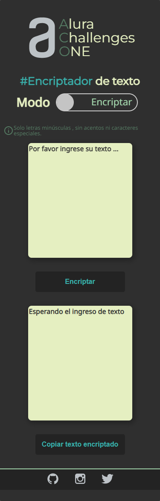
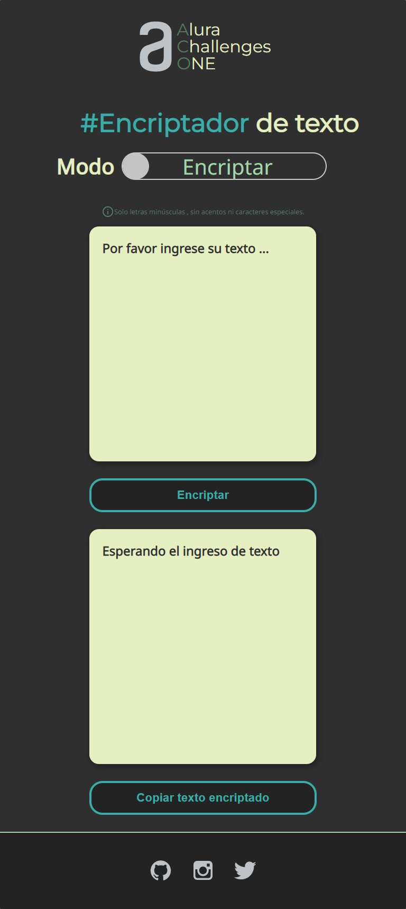
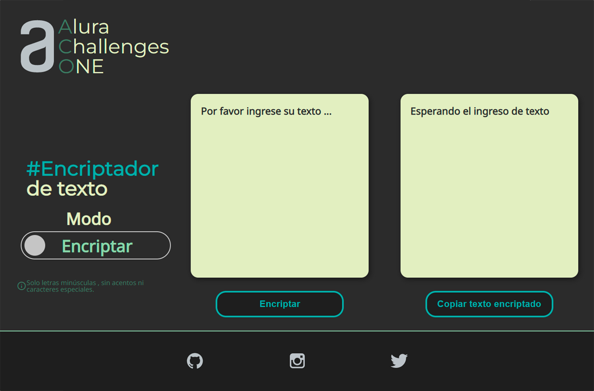

<h1 align="center">Desafio Encriptador de texto </h1>

## Descripción

Se trata de una aplicación que encripta textos,
Las "llaves" de encriptación  son las siguientes:

La letra "e" se convierte a "enter"
La letra "i" se convierte a "imes"
La letra "a" se convierte a "ai"
La letra "o" se convierte a "ober"
La letra "u" se convierte a "ufat"

## Funcionamiento:

Funcion solo con letras minúsculas no se deben utilizar letras con acentos ni caracteres especiales.
Convierte una palabra a su forma encriptada y también devolver una palabra encriptada a su versión original.
Por ejemplo:

"gato" => "gaitober"
gaitober" => "gato"

El texto se debe ingresar en un campo de texto que será encriptado o desencriptado, y el usuario debe poder escoger entre las dos opciones.
El resultado sera mostrado en un campo de texto.

## Screenshots

<h2 align="center">Version movíl</h2>  
                                         

<h2 align="center">Version tablet</h2>  

<h2 align="center">Version desktop</h2>  

